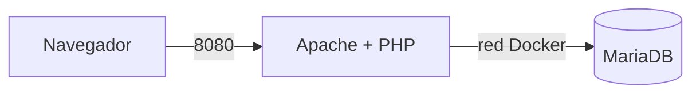

Descripción del Stack y Tecnologías
El stack utiliza Apache 2.4 como servidor web en el puerto 8080, MariaDB 11.2 como SGBD relacional y PHP 8.3 con la extensión mysqli como intérprete. El servidor ejecuta PHP y MariaDB procesando la lógica, consultando la base de datos y generando el HTML con la hora del servidor, y en el cliente ejecutan el navegador y JavaScript mostrando la interfaz y calculando la hora local del usuario.

Arquitectura del Sistema

Comandos de Despliegue
  - Clonar el repositorio y acceder a la carpeta
  cd salon-recreativo

  - Construir y levantar el stack
  docker compose up -d --build

  - Verificar estado de los servicios
  docker compose ps

1 Piensa: ¿por qué no le pasamos al servicio web la contraseña de root de la base de datos
(env_file: .env)?
Porque la aplicación PHP solo necesita leer y escribir en la 
base de datos arcade mcon el usuario jugador y pasar la contraseña de root al contenedor web
expondría permisos de administración y control si el contenedor web se llega a ver comprometido.

docker compose down detiene y borra los contenedores manteniendo los datos y compose down -v borra además el volumen db_data, eliminando permanentemente la base de datos.

2 -qué se ejecuta en el servidor y qué en el cliente, y por qué las dos horas podrían
no coincidir.
La hora del servidor se genera en PHP al procesar la petición de HTTP, mientras que la del cliente la calcula JavaScript con el reloj local de la máquina. Pueden no coincidir por desajustes horarios o diferencias en la zona horaria.

3- 
• Sin credenciales en el repositorio. 
ingrid@DESKTOP-T5B5SI7:~/salon-recreativo$ git ls-files | grep .env
ingrid@DESKTOP-T5B5SI7:~/salon-recreativo$
• Puerto 3306 no publicado
ingrid@DESKTOP-T5B5SI7:~/salon-recreativo$ docker compose ps
NAME                     IMAGE                                                                     COMMAND                  SERVICE   CREATED        STATUS                    PORTS
salon-recreativo-db-1    mariadb:11                                                                "docker-entrypoint.s…"   db        23 hours ago   Up 22 seconds (healthy)   3306/tcp
salon-recreativo-web-1   sha256:9e34458edae6ce16325b463274613e34e1616253d2e2f313f373bf6c425a8d4a   "docker-php-entrypoi…"   web       23 hours ago   Up 16 seconds             0.0.0.0:8080->80/tcp, [::]:8080->80/tcp
• La aplicación usa `jugador`, no `root`

• Apache y PHP no revelan su versión. 
ingrid@DESKTOP-T5B5SI7:~/salon-recreativo$ curl -I http://localhost:8080
HTTP/1.1 200 OK
Date: Thu, 01 Oct 2026 16:39:51 GMT
Server: Apache
Content-Type: text/html; charset=UTF-8

MariaDB [arcade]> SHOW GRANTS;
+--------------------------------------------------------------------------------------------------------+
| Grants for jugador@%                                                                                   |
+--------------------------------------------------------------------------------------------------------+
| GRANT USAGE ON *.* TO `jugador`@`%` IDENTIFIED BY PASSWORD '*77D0467C6FCC8FA6D6E3B9D9A7564F3F12BDED14' |
| GRANT ALL PRIVILEGES ON `arcade`.* TO `jugador`@`%`                                                    |
+--------------------------------------------------------------------------------------------------------+
2 rows in set (0.000 sec)

9 | MONEDA-1: ARC-7X3K | secreto        |      0 

🪙 MONEDA 2: ARC-Q9M2

PROBLEMAS Y SOLUCIONES
Al hacer la prueba de seguridad con el comando curl -I http://localhost:8080, la página mostraba la versión de Apache y de PHP, para ocultar esos datos, se edita el Dockerfile añadiendo las líneas para apagar la firma del servidor y la opción expose_php = Off. Después se vuelve a construir el contenedor con docker compose up -d --build y, al repetir la prueba con el curl, las versiones ya no aparecían.
